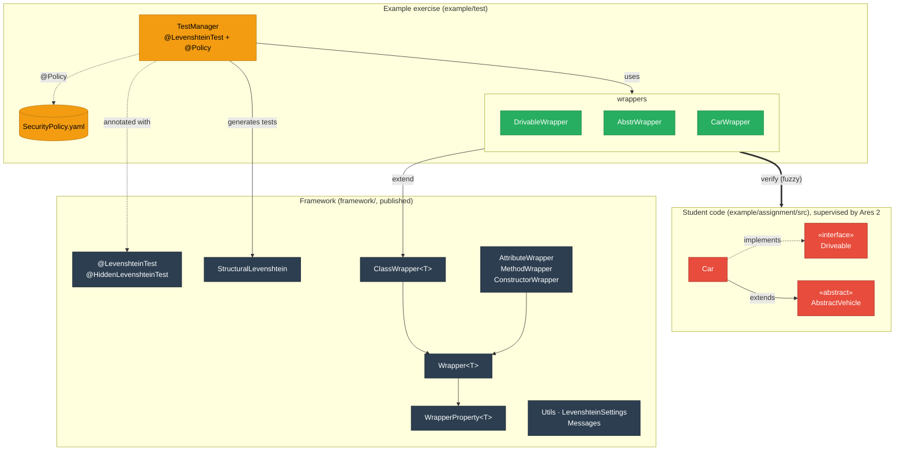

# Levenshtein Name Deviation Testing Framework

Structural and behavioural tests for student code that **tolerate small naming deviations** (typos,
case slips, `int` vs. `Integer`, ...) while still verifying the structure, built on
[Ares 2](https://github.com/ls1intum/Ares2) for exams and exercises on Artemis.

A student who writes `prize` instead of `price` loses the structural point for that attribute, but every
behavioural test still runs against their `prize`. They are not punished twice for one typo. What the
student sees:

```text
⚠️ DEVIATION in Car ⚠️
If possible actual will be used for further testing.
Expect:	private double price
Actual:	private double prize

❌ MISSING in Car ❌
Expect:	public void start()
```

### Key Features

✅ **Fuzzy name matching** for classes, methods and attributes; the closest candidate wins  
✅ **Structural verification** of modifiers, types, constructors, superclasses and interfaces  
✅ **Behavioural testing** through wrappers that call the student's (possibly misspelled) members  
✅ **Abstract classes and interfaces** instantiated through Byte Buddy subclasses  
✅ **Exercise Variants compatible**: names and types are plain strings and classes  
✅ **Secure by default**: `@LevenshteinTest` runs every test under Ares 2 supervision

### Why

Exact name matching fails correct solutions because of a typo. That frustrates students, distorts exam
results and creates manual re-grading work. This framework stays forgiving about names while keeping the
structural and behavioural checks strict.

## Contents

* [Quick Start](#quick-start): from zero to a running test in four steps
* [Writing Tests](#writing-tests): wrappers, structural and behavioural tests, configuration
* [Ares 2 Setup in Detail](#ares-2-setup-in-detail): what the example build does and why
* [How Matching Works](#how-matching-works): lookup, existence states, thresholds
* [Architecture](#architecture)
* [Versions and Migrating from 1000.x](#versions-and-migrating-from-1000x)
* [FAQ & Troubleshooting](#faq--troubleshooting) · [Limitations](#limitations) ·
  [Development](#development) · [References](#references) · [License](#license)

---

## Quick Start

**Requirements:** JDK 25 and Maven 3.9+. Ares 2.2.1, JUnit 6, AssertJ and Byte Buddy come in through the
example's `pom.xml`.

### Step 1: Run the example

```bash
git clone https://github.com/ValentinHerrmann/Levenshtein-Testing-Framework.git
cd Levenshtein-Testing-Framework
./mvnw -B verify        # builds the framework and runs the example exercise under Ares 2
```

The repository contains two modules:

| Module | Content |
|---|---|
| [`framework/`](framework) | The published library `io.github.valentinherrmann:levenshtein-testing-framework` |
| [`example/`](example) | A complete reference exercise in the Artemis layout (`assignment/src` = student code, `test/` = instructor tests) protected by Ares 2. **This is the template for your exam repository.** |

### Step 2: Create your exam repository from `example/`

Copy the contents of `example/` (`pom.xml`, `assignment/`, `test/`) into your exam repository. Copy
`mvnw`, `mvnw.cmd` and `.mvn/wrapper/` as well if you want the Maven wrapper. Then adapt it. In this
walkthrough the student package is `org.example.exam` and the test package is `org.example.tests`:

| Where | What to change |
|---|---|
| `pom.xml` → `levenshtein.version` | The framework version. `2000.0.0` is not on Maven Central yet: until it is, run `./mvnw -B install -pl framework` in this repository and keep `2000.0.0-SNAPSHOT`. |
| `pom.xml` → antrun `verify-ares-reserved-packages-v2` | Replace `io/github/valentinherrmann/example/tests/**` with your test package, e.g. `org/example/tests/**`. |
| `assignment/src/`, `test/io/`, `test/sandbox/` | Delete the example's student code, tests and sandbox file. |
| `test/SecurityPolicy.yaml` | `theSupervisedCodeUsesTheFollowingPackage: "org.example.exam"`, `theMainClassInsideThisPackageIs`, the list `theFollowingClassesAreTestClasses` (the **exact** names of all your test and wrapper classes), and `regardingFileSystemInteractions: [ ]`. |
| Your test classes | `@Policy(value = "test/SecurityPolicy.yaml", withinPath = "classes/org/example/exam")` |

> [!IMPORTANT]
> The student package must not be a prefix of the test package (`org.example.exam` and
> `org.example.exam.tests` would be wrong). The reasons for every setting are in
> [Ares 2 Setup in Detail](#ares-2-setup-in-detail).

### Step 3: Write your first wrapper and test

A **wrapper** describes one class you expect from the student. The framework finds the student's class and
members, even with small typos, and the tests work through the wrapper.

<details open>
<summary><b>Student code</b>: <code>assignment/src/org/example/exam/Car.java</code> (the expected solution)</summary>

```java
package org.example.exam;

public class Car {
    private double price;
    private double speed;

    public Car(double price) {
        this.price = price;
    }

    public void start() {
        speed = 10.0;
    }

    public double getPrice() {
        return price;
    }
}
```
</details>

**Wrapper**: `test/org/example/tests/CarWrapper.java`

```java
package org.example.tests;

import io.github.valentinherrmann.levenshtein.*;

/** Describes the expected class: public class Car in package org.example.exam. */
public class CarWrapper<T> extends ClassWrapper<T> {
    // One field per expected member; the structural tests find them via reflection.
    private final AttributeWrapper<T, Double> price;
    private final AttributeWrapper<T, Double> speed;
    private final ConstructorWrapper<T> constructor;
    private final MethodWrapper<T, Void> start;
    private final MethodWrapper<T, Double> getPrice;

    public CarWrapper() {
        super("Car", "org.example.exam", "public");
        price = new AttributeWrapper<>(this, "price", double.class, "private");
        speed = new AttributeWrapper<>(this, "speed", double.class, "private");
        constructor = new ConstructorWrapper<>(this, new Class<?>[]{double.class}, "public");
        start = new MethodWrapper<>(this, "start", void.class, "public");
        getPrice = new MethodWrapper<>(this, "getPrice", double.class, "public");
    }

    // Accessors for the behavioural tests
    public AttributeWrapper<T, Double> price() { return price; }
    public AttributeWrapper<T, Double> speed() { return speed; }
    public MethodWrapper<T, Void> start() { return start; }
    public MethodWrapper<T, Double> getPrice() { return getPrice; }

    // The default instance used by newObj(), getObj() and invoke()
    @Override
    public Object getObj(boolean forceNew, boolean useByteBuddy) {
        return getObj(forceNew, useByteBuddy, constructor, 30000.0);
    }
}
```

**Test**: `test/org/example/tests/CarTest.java`

```java
package org.example.tests;

import static org.assertj.core.api.Assertions.assertThat;

import java.util.List;

import org.junit.jupiter.api.DynamicTest;
import org.junit.jupiter.api.Test;
import org.junit.jupiter.api.TestFactory;

import de.tum.cit.ase.ares.api.Policy;
import io.github.valentinherrmann.levenshtein.LevenshteinSettings;
import io.github.valentinherrmann.levenshtein.LevenshteinTest;
import io.github.valentinherrmann.levenshtein.StructuralLevenshtein;
import io.github.valentinherrmann.levenshtein.StructuralLevenshtein.DetailLevel;

@LevenshteinTest
@Policy(value = "test/SecurityPolicy.yaml", withinPath = "classes/org/example/exam")
class CarTest {

    static {
        LevenshteinSettings.setLanguage(LevenshteinSettings.Language.ENGLISH); // default: German
    }

    static final CarWrapper<?> car = new CarWrapper<>();

    // Structure: Class[Car], Constructors[Car], Attributes[Car], Methods[Car]
    @TestFactory
    List<DynamicTest> structure() {
        return StructuralLevenshtein.structuralTestFactory(DetailLevel.ONE_PER_MEMBER_CATEGORY, car);
    }

    // Behaviour: still runs if the student wrote "prize" instead of "price"
    @Test
    void startSetsSpeed() {
        Object c = car.newObj();
        car.start().invokeOnSpecificObject(c);
        assertThat(car.speed().getValue(c)).isEqualTo(10.0);
    }

    @Test
    void getPriceReturnsPrice() {
        car.testGetter(car.price(), car.getPrice());
    }
}
```

The matching `SecurityPolicy.yaml` lists the two test classes:

```yaml
  theSupervisedCodeUsesTheFollowingPackage: "org.example.exam"
  theMainClassInsideThisPackageIs: "Car"
  theFollowingClassesAreTestClasses:
    - "org.example.tests.CarTest"
    - "org.example.tests.CarWrapper"
```

### Step 4: Run it and read the results

```bash
./mvnw -B verify
```

With the solution above, all 6 tests pass. Every expected element ends up in one of three states:

* **`EXACT`**: matches the specification. ✅
* **`DEVIATES`**: found with small differences, e.g. `prize` for `price` (20 % of the name length is
  tolerated by default). The **structural test fails** with a `DEVIATION` message, but the **behavioural
  tests use the student's element** and can still pass.
* **`MISSING`**: not found, e.g. `strat()` for `start()` (a swap of two letters counts as 2 edits = 40 %).
  The structural test fails, and so does every behavioural test that needs the element:
  `Method public void start() in class Car is not implemented as expected.`

That's it. Next: describe more classes ([Writing Tests](#writing-tests)) and look at the full example in
[`example/test`](example/test/io/github/valentinherrmann/example/tests), which covers an interface, an
abstract class, inheritance, overloading and Exercise Variants.

---

## Writing Tests

### Wrapper cheat sheet

| Wrapper | Constructor | Describes |
|---|---|---|
| `ClassWrapper<T>` | `(name, package, superClassWrapper, interfaceWrappers, modifiers...)`<br>`(name, package, modifiers...)` | A class, abstract class or interface. `superClassWrapper == null` means "extends `Object`". |
| `AttributeWrapper<T, V>` | `(this, name, type, modifiers...)` | A field, e.g. `(this, "price", double.class, "private")` |
| `MethodWrapper<T, R>` | `(this, name, returnType, modifiers...)`<br>`(this, name, returnType, new Class<?>[]{paramTypes}, modifiers...)` | A method, e.g. `(this, "calculateCost", double.class, new Class<?>[]{int.class}, "public")` |
| `ConstructorWrapper<T>` | `(this, new Class<?>[]{paramTypes}, modifiers...)` | A constructor |

* **Modifiers** are plain strings: `"public"`, `"private"`, `"protected"`, `"static"`, `"final"`, `"abstract"`, ...
  A typo throws `IllegalArgumentException` as soon as the wrapper is created.
* **Member wrappers must be (non-static) fields** of your `ClassWrapper` subclass. That's how the
  structural tests find them.
* **Every `ClassWrapper` subclass implements `getObj(boolean forceNew, boolean useByteBuddy)`**, which
  defines the default instance, usually by delegating to
  `getObj(forceNew, useByteBuddy, constructorWrapper, args...)`.
* Nothing is looked up when a wrapper is created. Each wrapper looks up its element **once**, on first use,
  inside a supervised test.

### Inheritance and interfaces

Pass the wrappers of the expected superclass and interfaces to the subclass wrapper, and create them in
dependency order (see `beforeAll()` in
[`TestManager`](example/test/io/github/valentinherrmann/example/tests/TestManager.java)):

```java
driveable = new DrivableWrapper<>();                 // interface Driveable
vehicle   = new AbstrWrapper<>();                    // abstract class AbstractVehicle
car       = new CarWrapper<>(vehicle, driveable);    // class Car extends AbstractVehicle implements Driveable

// inside CarWrapper:
public CarWrapper(ClassWrapper<?> superClass, ClassWrapper<?>... interfaces) {
    super("Car", "org.example.exam", superClass, interfaces, "public");
    ...
}
```

The superclass and interface checks compare the classes the wrappers *found*, so a deviating superclass
name still counts. Inheriting indirectly, or implementing an additional interface, is `DEVIATES`.

### Structural tests

```java
@TestFactory
List<DynamicTest> structure() {
    return StructuralLevenshtein.structuralTestFactory(DetailLevel.ONE_PER_MEMBER_CATEGORY, driveable, vehicle, car);
}
```

| Detail level | Generated tests |
|---|---|
| `ONE_FOR_EVERYTHING` | `Structural[all]` |
| `ONE_PER_CLASS` | `Structural[Car]`, ... |
| `ONE_PER_MEMBER_CATEGORY` | `Class[Car]`, `Constructors[Car]`, `Attributes[Car]`, `Methods[Car]`, ... |
| `ONE_PER_MEMBER` | `Class[Car]`, `Constructor[public Car(String, int)]`, `Attribute[Car.price]`, `Method[Car.public void start()]`, ... |

Pick the level that matches your grading granularity: each generated test shows up as its own test case
(on Artemis, too). Tests come in a deterministic order, and duplicate names get a `#2` suffix instead of replacing each
other. Student code only runs inside the generated tests, i.e. supervised by Ares. If a single element
cannot be checked, that element is reported instead of the whole test aborting.

### Behavioural tests

```java
Object car = carWrapper.newObj();                                   // new default instance
carWrapper.start().invokeOnSpecificObject(car);                     // calls the student's method
double speed = carWrapper.speed().getValue(car);                    // reads the (private) attribute
carWrapper.speed().setValue(car, 0.0);                              // writes it
double cost = carWrapper.calculateCost().invoke();                  // on the cached default instance
carWrapper.testGetter(carWrapper.price(), carWrapper.getPrice());   // attribute == getter
Object other = carWrapper.constructor().invoke(25000.0);            // a specific constructor

// expected exceptions (here: a MethodWrapper for "void setYear(int)")
IllegalArgumentException e = carWrapper.setYear().invokeExpectingException(IllegalArgumentException.class, car, -1);
```

| Call | Target |
|---|---|
| `invoke(args...)`, `getValue()`, `setValue(value)` | the cached default instance (`getObj()`), or `null` for static members |
| `invokeOnSpecificObject(obj, args...)`, `getValue(obj)`, `setValue(obj, value)` | `obj` |
| `getObj()` | the cached default instance. The cache is only reused for the same constructor and arguments. |
| `newObj()` / `getObj(true, ...)` | always a new instance |
| `setCachedObj(obj)` | pins an object you created yourself as the default instance |

* If the student's element is `MISSING`, the call fails with "... is not implemented as expected. See
  structural Tests for details".
* An exception thrown by student code fails the test with its type and message (the original exception is
  attached as the cause). Ares security violations and assertion failures are passed through unchanged.
* `Utils.saveCast(value, type)` converts numeric results (e.g. `int` → `double`). It fails with a readable
  message instead of producing a `ClassCastException` later.
* Static members: pass `null` as the object, or use `invoke(...)` / `getValue()`.

### Abstract classes and interfaces (Byte Buddy)

Abstract classes and interfaces are instantiated through a Byte Buddy subclass, using the actual
constructor (including `protected` ones). Concrete classes are **always** created with their own
constructor, so `final` classes and `getClass()`-based `equals` work. Calling an abstract method on such
an instance throws `AbstractMethodError`; test interface behaviour through an implementing class.
(The `useByteBuddy` parameter of `getObj` is ignored since 2000.0.0.)

### Configuration

Configure at runtime, e.g. in a static initializer of your test class:

```java
static {
    LevenshteinSettings.setLanguage(LevenshteinSettings.Language.ENGLISH);  // default: DEUTSCH
    LevenshteinSettings.setClassNameDeviationThreshold(10);                 // default: 20 (percent)
    LevenshteinSettings.setMethodNameDeviationThreshold(20);
    LevenshteinSettings.setAttributeNameDeviationThreshold(20);
}
```

`LevenshteinSettings.reset()` restores the defaults. Timeouts: `@LevenshteinTest` carries
`@StrictTimeout(5)`. A `@StrictTimeout` on the class or a method overrides it. (`regardingTimeouts` in the
policy is not enforced by Ares 2.2.1.)

### Exercise Variants

Keep all expected names and types in one place and read them in the wrappers, as in
[`example/.../Constants.java`](example/test/io/github/valentinherrmann/example/tests/Constants.java):

```java
public static String concreteClass() {
    return switch (variant) {
        case DEFAULT -> "Car";
    };
}
```

### Organising larger test suites

The example splits the tests into three layers: `TestManager` carries the annotations and the
`@Test`/`@TestFactory` methods, `TestAbstr`/`TestImpl`/`TestInterface` hold the test logic as static
methods, and `wrappers/*` describe the classes. Only the annotated class needs `@LevenshteinTest` and
`@Policy`, but **every** helper class must be listed in `theFollowingClassesAreTestClasses`.

---

## Ares 2 Setup in Detail

The example's [`pom.xml`](example/pom.xml) and [`test/`](example/test) already contain everything below.
This section explains it, so you know what you may not remove.

**1. Dependencies.** Ares must be `provided`, *not* `test`: with test scope AspectJ silently weaves nothing.

```xml
<dependency>
    <groupId>de.tum.cit.ase</groupId>
    <artifactId>ares</artifactId>
    <version>2.2.1</version>
    <scope>provided</scope>
</dependency>
<dependency>
    <groupId>org.aspectj</groupId>
    <artifactId>aspectjrt</artifactId>
    <version>1.9.25.1</version>
</dependency>
<dependency>
    <groupId>io.github.valentinherrmann</groupId>
    <artifactId>levenshtein-testing-framework</artifactId>
    <version>2000.0.0</version>
    <scope>test</scope>
</dependency>
```

**2. Ares 2 build wiring.** Use `aspectj-maven-plugin` (weaves the student classes), `maven-dependency-plugin`
(copies the Ares agent) and Surefire with `-javaagent` plus the module flags. Copy the plugin blocks from
[`example/pom.xml`](example/pom.xml); they follow the Ares guide
"[transform an Ares 1 protected project into an Ares 2 protected project](https://ls1intum.github.io/Ares2/instructor/transform-ares-1-into-ares-2/)"
(Postcompile, Maven).

**3. Reserved-package guard: mandatory.** Student classes in `target/classes` come *before* every
dependency JAR on the test classpath. A student who submits `io/github/valentinherrmann/levenshtein/StructuralLevenshtein.java`
would replace the framework, and with it every structural test. The antrun execution
`verify-ares-reserved-packages-v2` in `example/pom.xml` therefore lists the Ares prefixes **plus**
`io/github/valentinherrmann/levenshtein/**`, the instructor test package, `org/junit/**`, `org/assertj/**`
and `org/opentest4j/**`, and fails the build otherwise.

**4. Security policy and annotations.**

```java
@LevenshteinTest   // = @Public + @StrictTimeout(5) + @MirrorOutput
@Policy(value = "test/SecurityPolicy.yaml", withinPath = "classes/org/example/exam")
class ExamTest {
    // @Test, @TestFactory ... (plain JUnit annotations)
}
```

* `@LevenshteinTest` (or `@HiddenLevenshteinTest` plus `@Deadline`) **activates** Ares. A class with
  `@Policy` but without an Ares test-type annotation runs **completely unsupervised**, silently.
* `@Policy` is exam specific and therefore not part of `@LevenshteinTest`. The nearest `@Policy` wins;
  policies are never merged.
* `SecurityPolicy.yaml`: see [`example/test/SecurityPolicy.yaml`](example/test/SecurityPolicy.yaml).
  - Use `JAVA_USING_MAVEN_ARCHUNIT_AND_ASPECTJ`.
  - `theFollowingClassesAreTestClasses` must list the **exact fully qualified names** of every instructor
    test, helper, constant and wrapper class. Never use a package name there, and never a class students
    can edit.
  - For an exam, normally keep all six permission lists empty.
* Use a student package that is not a prefix of your test or wrapper packages.

### Ares 2 behaviour worth knowing

* **Endless loops end the JVM.** On a timeout, Ares 2 interrupts the student code. Student code cannot
  react to that interrupt (all thread operations, including `Thread.sleep` and `Object.wait`, are blocked),
  so Ares halts the test JVM with exit code 124. Configure Surefire with `reuseForks=false` (as in the
  example), so only the tests of the affected class are lost, and keep tests that might loop in their own
  classes.
* **Static analysis looks at the whole submission.** A single forbidden call anywhere in the student code
  (e.g. `Thread.sleep`, file access) fails *every* supervised test, not only the one that runs the code.
* **No negative package rules.** Ares 1's `@BlacklistPackage("java.util.stream.*")` has no Ares 2
  counterpart (`java.*` is always permitted). If an exam must forbid streams, write a dedicated
  structural/ArchUnit test for it.
* **`*_INSTRUMENTATION` modes are not usable with Ares 2.2.1**: the agent fails to transform student
  classes that declare records.
* The example contains self-checks that fail if the sandbox is not active:
  [`SecurityControlTest`](example/test/io/github/valentinherrmann/example/tests/SecurityControlTest.java)
  (permitted/forbidden file read) and
  [`TimeoutControlTest`](example/test/io/github/valentinherrmann/example/tests/TimeoutControlTest.java)
  (deadline). They need the `SandboxControl` class in the student sources, so do not copy them into a
  real exam. Use them to validate your setup once.

---

## How Matching Works

### 1. Lookup with deviation

Each wrapper looks up its element **once**, on first use:

1. **Exact match** by name (and parameter types).
2. Otherwise the **closest candidate** within the threshold, by Levenshtein distance with ties broken
   by name. Synthetic members and members that *another* wrapper of the same class expects exactly are
   skipped, so a missing `getMaxSpeed()` cannot take `getMinSpeed()`.
3. Classes are found by scanning the compiled classes of the expected package, so case slips such as
   `myCar` for `MyCar` are found too (within the threshold: `car` for `Car` is 33 % and therefore `MISSING`
   at the default of 20). Classes are loaded **without initialisation**, so student static initialisers do
   not run during the structural check.

### 2. Existence states

| State | Meaning | Examples |
|---|---|---|
| `EXACT` | Matches the specification | `price` / `price` |
| `DEVIATES` | Found with small differences; the structural test fails, behavioural tests use the actual element | `calculateCost` / `calculateCots`, `int` / `Integer`, `protected` instead of `public`, inherited indirectly, additional interface, unexpected `static` |
| `MISSING` | Not found or not usable as specified; the structural test and every behavioural test that needs it fail | name too different, `String` vs. `int`, missing `static` |
| `UNCHECKED` | Internal "not looked up yet"; never wins an aggregation and is never shown | |

Name thresholds are percentages of the longer name:
`distance * 100 / max(expected.length(), actual.length()) <= threshold`.

```
threshold 20:  "price" vs "pric"                   -> 20.0 %  DEVIATES
               "calculateCost" vs "calculateCots"  -> 15.4 %  DEVIATES
               "start" vs "strat"                  -> 40.0 %  MISSING
               "Car" vs "Cra"                      -> 66.7 %  MISSING
```

Short names tolerate fewer typos: at the default of 20, a name of 4 characters or less tolerates no edit
at all. Lower the threshold for an element kind with [`LevenshteinSettings`](#configuration) if 20 % is too
generous for long names.

Types: exact → `EXACT`. Primitive ⇄ wrapper, a wider declared type (`Object` for `String`), or a wider
numeric type (`long` for `int`) → `DEVIATES`. Anything else → `MISSING`.

Modifiers: a missing `static` → `MISSING`. A different visibility, a missing `final`/`abstract`, or an
unexpected `static` on an attribute or method → `DEVIATES`. An unknown modifier in the specification (a
typo) throws `IllegalArgumentException` when the wrapper is created.

---

## Architecture



Every expected class of the student code has a wrapper (a `ClassWrapper` subclass) that describes it and
finds the student's actual class and members, even with small naming deviations. `TestManager` generates
the structural tests from the wrappers and uses them for the behavioural tests, under Ares 2 supervision
(`@LevenshteinTest` + `@Policy`). Detailed class diagrams of the framework and of the example wrappers are
in [docs/diagrams.md](docs/diagrams.md).

**`io.github.valentinherrmann.levenshtein`** (framework, published)
* `Wrapper<T>`: base of all wrappers (name, modifiers, existence, messages)
* `ClassWrapper<T>`: classes, abstract classes and interfaces, including superclass, interfaces and instantiation
* `AttributeWrapper<T,V>`, `MethodWrapper<T,R>`, `ConstructorWrapper<T>`: members
* `GenericClassWrapper<T>`: wraps an already loaded class (actual superclass and interfaces)
* `WrapperProperty<T>`: expected vs. actual value plus existence
* `StructuralLevenshtein`: JUnit `DynamicTest` factory
* `LevenshteinTest` / `HiddenLevenshteinTest`: composed Ares 2 annotations
* `LevenshteinSettings`: runtime configuration (thresholds, language)
* `Messages`: German/English feedback
* `Utils`: Levenshtein distance, type compatibility, `saveCast`

**`example/`** (not published)
* `assignment/src/.../vehicles`: the "student" solution (`Car`, `AbstractVehicle`, `Driveable`), explained
  in [`SIMPLIFIED_CONCEPTS.md`](example/SIMPLIFIED_CONCEPTS.md)
* `test/.../tests`: `TestManager` (tests), `TestAbstr`/`TestImpl`/`TestInterface` (test logic),
  `Constants` (Exercise Variants), `wrappers/*`, `SecurityPolicy.yaml`

---

## Versions and Migrating from 1000.x

`0260.9.0` was published accidentally (instead of `0.9.0`); `1000.0.0` acts as `1.0.0`. **`2000.0.0`** is
the first release of the Ares 2 / Java 25 line and contains the breaking changes below.

| 1000.x | 2000.0.0 |
|---|---|
| Ares 1 (`de.tum.in.ase:artemis-java-test-sandbox`) | Ares 2 (`de.tum.cit.ase:ares`, provided), Java 25 |
| `@LevenshteinTest` = Ares 1 security annotations; **the sandbox was never active** because no `@Public`/`@Hidden` was included | `@LevenshteinTest` = `@Public @StrictTimeout(5) @MirrorOutput`; plus `@Policy` + `SecurityPolicy.yaml` in the exam |
| `io.github.valentinherrmann.test.TestSettings` constants (inlined at compile time, not changeable) | `io.github.valentinherrmann.levenshtein.LevenshteinSettings` setters |
| `io.github.valentinherrmann.test.Messages.X` (String) | `io.github.valentinherrmann.levenshtein.Messages.X.get()` / `.format(...)` |
| `TestSettings.BASE_PACKAGE`, `variant` | in your own `Constants` |
| `useByteBuddy=false` for private members | not needed; the parameter is ignored |
| `setObj` writes `obj` directly | `setCachedObj(obj)` |
| Exceptions from student code: generic failure | type and message in the failure, `invokeExpectingException(...)` |

---

## FAQ & Troubleshooting

**The feedback is in German.** That is the default. Call
`LevenshteinSettings.setLanguage(LevenshteinSettings.Language.ENGLISH)`, see [Configuration](#configuration).

**The policy seems to have no effect.** Check that the class carries `@LevenshteinTest`
(or another Ares test-type annotation), that `withinPath` is `classes/<student/package/path>`, that Ares is
`provided`, and that `SecurityControlTest` of the example passes in your setup.

**All tests fail with "... was blocked by Ares".** The static analysis found a forbidden call somewhere in
the student code (see the message). This is intended. If the exercise legitimately needs the operation,
grant exactly that in the policy.

**The test JVM crashed with exit code 124.** A test timed out in student code. Ares halts the JVM in that
case, see [Ares 2 behaviour worth knowing](#ares-2-behaviour-worth-knowing).

**A similar name is not found.** Compute `distance * 100 / maxLength` and compare it with the threshold
(see [Existence states](#2-existence-states)). Method lookup also requires the same number of parameters
(types may differ only primitive ⇄ wrapper).

**A structural test fails although the behavioural tests pass.** Intended: the element `DEVIATES`. The
student loses the structural point, not the behavioural ones.

**Extra members in the student code?** They are ignored. Only an additional *interface* is reported as
`DEVIATES`.

**Generic classes?** Type parameters are not part of the specification; use the erased types.

---

## Limitations

* Thresholds are global per element kind, not per wrapper.
* No verification of generic type parameters, enums, record components or annotations.
* Method parameter types must match (up to primitive ⇄ wrapper); reordered parameters are `MISSING`.

---

## Development

```bash
./mvnw -B verify                                   # framework unit tests + example under Ares 2
./mvnw -B install -pl framework                    # install the framework into ~/.m2 for your exam repository
./mvnw -B -P release -pl framework verify          # + sources, javadoc, GPG signature (needs a key)
```

Releases are published to Maven Central by the `Publish` workflow on a GitHub release
(`-P release -pl framework deploy`).

## References

* Ares 2: https://github.com/ls1intum/Ares2 and its migration guide "transform Ares 1 into Ares 2"
* Byte Buddy: https://bytebuddy.net/
* Levenshtein distance: https://en.wikipedia.org/wiki/Levenshtein_distance

## License

GNU General Public License v3.0, see [LICENSE](LICENSE). Contributions and feedback are welcome!
