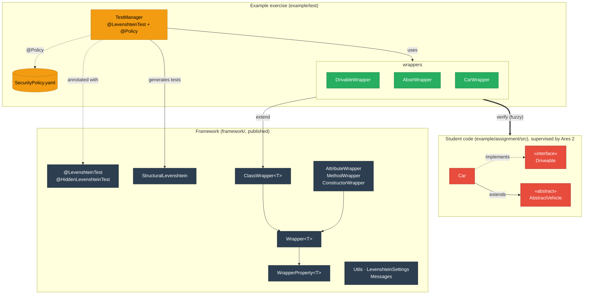

# Levenshtein Name Deviation Testing Framework

Structural and behavioural tests for student code that **tolerate small naming deviations** (typos,
case slips, `int` vs. `Integer`, ...) while still verifying the structure, built on
[Ares 2](https://github.com/ls1intum/Ares2) for exams and exercises on Artemis.

> **Version notice:** `0260.9.0` was published accidentally (instead of `0.9.0`); `1000.0.0` acts as
> `1.0.0`. **`2000.0.0`** is the first release of the Ares 2 / Java 25 line and contains breaking changes,
> see [Migrating from 1000.x](#migrating-from-1000x).

## Overview

The framework uses **Levenshtein distance** for fuzzy name matching and **reflection** for structure
analysis. Every expected element is reported as `EXACT`, `DEVIATES` (found with small differences;
behavioural tests keep using the student's actual element) or `MISSING`.

### Key Features

✅ **Fuzzy name matching** for classes, methods and attributes; the closest candidate wins  
✅ **Structural verification** of modifiers, types, constructors, superclasses and interfaces  
✅ **Behavioural testing** through wrappers that call the student's (possibly misspelled) members  
✅ **Abstract classes and interfaces** instantiated through Byte Buddy subclasses  
✅ **Exercise Variants compatible**: names and types are plain strings and classes  
✅ **Secure by default**: `@LevenshteinTest` runs every test under Ares 2 supervision

### Why

Exact name matching fails correct solutions because of a typo. That frustrates students, distorts exam
results and creates manual re-grading work. This framework stays forgiving about names while keeping the
structural and behavioural checks strict.

---

## Requirements

* **JDK 25** (build and test runtime, including the Artemis build agents)
* **Maven 3.9+**
* **Ares 2.2.1** (`de.tum.cit.ase:ares`), JUnit 6, AssertJ, Byte Buddy ≥ 1.18. These are all provided by
  the exam project, see below.

---

## Quick Start

### Try it out

```bash
./mvnw -B verify        # builds the framework and runs the example exercise under Ares 2
```

The repository contains two modules:

| Module | Content |
|---|---|
| [`framework/`](framework) | The published library `io.github.valentinherrmann:levenshtein-testing-framework` |
| [`example/`](example) | A complete reference exercise in the Artemis layout (`assignment/src`, `test/`) protected by Ares 2. **Copy this when you set up an exam repository.** |

### Use it in an exam repository

An exam repository needs four things. All of them are shown, working, in
[`example/pom.xml`](example/pom.xml) and [`example/test`](example/test).

**1. Dependencies.** Ares must be `provided`, *not* `test`: with test scope AspectJ silently weaves nothing.

```xml
<dependency>
    <groupId>de.tum.cit.ase</groupId>
    <artifactId>ares</artifactId>
    <version>2.2.1</version>
    <scope>provided</scope>
</dependency>
<dependency>
    <groupId>org.aspectj</groupId>
    <artifactId>aspectjrt</artifactId>
    <version>1.9.25.1</version>
</dependency>
<dependency>
    <groupId>io.github.valentinherrmann</groupId>
    <artifactId>levenshtein-testing-framework</artifactId>
    <version>2000.0.0</version>
    <scope>test</scope>
</dependency>
```

**2. Ares 2 build wiring.** Use `aspectj-maven-plugin` (weaves the student classes), `maven-dependency-plugin`
(copies the Ares agent) and Surefire with `-javaagent` plus the module flags. Copy the plugin blocks from
[`example/pom.xml`](example/pom.xml); they follow the Ares guide
"[transform an Ares 1 protected project into an Ares 2 protected project](https://ls1intum.github.io/Ares2/instructor/transform-ares-1-into-ares-2/)"
(Postcompile, Maven).

**3. Reserved-package guard: mandatory.** Student classes in `target/classes` come *before* every
dependency JAR on the test classpath. A student who submits `io/github/valentinherrmann/levenshtein/StructuralLevenshtein.java`
would replace the framework, and with it every structural test. The antrun execution
`verify-ares-reserved-packages-v2` in `example/pom.xml` therefore lists the Ares prefixes **plus**
`io/github/valentinherrmann/levenshtein/**`, the instructor test package, `org/junit/**`, `org/assertj/**`
and `org/opentest4j/**`, and fails the build otherwise.

**4. Security policy and annotations.**

```java
@LevenshteinTest   // = @Public + @StrictTimeout(5) + @MirrorOutput
@Policy(value = "test/SecurityPolicy.yaml", withinPath = "classes/org/example/exam")
class ExamTest {
    // @Test, @TestFactory ... (plain JUnit annotations)
}
```

* `@LevenshteinTest` (or `@HiddenLevenshteinTest` plus `@Deadline`) **activates** Ares. A class with
  `@Policy` but without an Ares test-type annotation runs **completely unsupervised**, silently.
* `@Policy` is exam specific and therefore not part of `@LevenshteinTest`. The nearest `@Policy` wins;
  policies are never merged.
* `SecurityPolicy.yaml`: see [`example/test/SecurityPolicy.yaml`](example/test/SecurityPolicy.yaml).
  - Use `JAVA_USING_MAVEN_ARCHUNIT_AND_ASPECTJ`.
  - `theFollowingClassesAreTestClasses` must list the **exact fully qualified names** of every instructor
    test, helper, constant and wrapper class. Never use a package name there, and never a class students
    can edit.
  - For an exam, normally keep all six permission lists empty.
* Use a student package that is not a prefix of your test or wrapper packages.

#### Ares 2 behaviour worth knowing

* **Endless loops end the JVM.** On a timeout, Ares 2 interrupts the student code. Student code cannot
  react to that interrupt (all thread operations, including `Thread.sleep` and `Object.wait`, are blocked),
  so Ares halts the test JVM with exit code 124. Configure Surefire with `reuseForks=false` (as in the
  example), so only the tests of the affected class are lost, and keep tests that might loop in their own
  classes.
* **Static analysis looks at the whole submission.** A single forbidden call anywhere in the student code
  (e.g. `Thread.sleep`, file access) fails *every* supervised test, not only the one that runs the code.
* **No negative package rules.** Ares 1's `@BlacklistPackage("java.util.stream.*")` has no Ares 2
  counterpart (`java.*` is always permitted). If an exam must forbid streams, write a dedicated
  structural/ArchUnit test for it.
* **`*_INSTRUMENTATION` modes are not usable with Ares 2.2.1**: the agent fails to transform student
  classes that declare records.
* The example contains self-checks that fail if the sandbox is not active:
  [`SecurityControlTest`](example/test/io/github/valentinherrmann/example/tests/SecurityControlTest.java)
  (permitted/forbidden file read) and
  [`TimeoutControlTest`](example/test/io/github/valentinherrmann/example/tests/TimeoutControlTest.java)
  (deadline). They need the `SandboxControl` class in the student sources, so do not copy them into a
  real exam. Use them to validate your setup once.

### Basic usage

```java
// 1. Describe the expected class
public class CarWrapper<T> extends ClassWrapper<T> {
    private final AttributeWrapper<T, Double> price;
    private final AttributeWrapper<T, Double> speed;
    private final ConstructorWrapper<T> constructor;
    private final MethodWrapper<T, Void> start;

    public CarWrapper(ClassWrapper<?> superClass, ClassWrapper<?>... interfaces) {
        super("Car", "org.example.exam", superClass, interfaces, "public");
        price = new AttributeWrapper<>(this, "price", double.class, "private");
        speed = new AttributeWrapper<>(this, "speed", double.class, "private");
        constructor = new ConstructorWrapper<>(this, new Class<?>[]{String.class, int.class, double.class}, "public");
        start = new MethodWrapper<>(this, "start", void.class, "public");
    }

    public AttributeWrapper<T, Double> price() { return price; }
    public AttributeWrapper<T, Double> speed() { return speed; }
    public MethodWrapper<T, Void> start() { return start; }

    // default instance used when a test passes no object
    @Override
    public Object getObj(boolean forceNew, boolean useByteBuddy) {
        return getObj(forceNew, useByteBuddy, constructor, "BMW", 2023, 30000.0);
    }
}

// 2. Structural and behavioural tests
@LevenshteinTest
@Policy(value = "test/SecurityPolicy.yaml", withinPath = "classes/org/example/exam")
class ExamTest {
    static CarWrapper<?> car = new CarWrapper<>(null);

    @TestFactory
    List<DynamicTest> structure() {
        return StructuralLevenshtein.structuralTestFactory(DetailLevel.ONE_PER_MEMBER_CATEGORY, car);
    }

    @Test
    void startSetsSpeed() {
        Object c = car.newObj();
        car.start().invokeOnSpecificObject(c);
        assertThat(car.speed().getValue(c)).isEqualTo(10.0);
    }
}
```

---

## Architecture



Every expected class of the student code has a wrapper (a `ClassWrapper` subclass) that describes it and
finds the student's actual class and members, even with small naming deviations. `TestManager` generates
the structural tests from the wrappers and uses them for the behavioural tests, under Ares 2 supervision
(`@LevenshteinTest` + `@Policy`). Detailed class diagrams of the framework and of the example wrappers are
in [docs/diagrams.md](docs/diagrams.md).

**`io.github.valentinherrmann.levenshtein`** (framework, published)
* `Wrapper<T>`: base of all wrappers (name, modifiers, existence, messages)
* `ClassWrapper<T>`: classes, abstract classes and interfaces, including superclass, interfaces and instantiation
* `AttributeWrapper<T,V>`, `MethodWrapper<T,R>`, `ConstructorWrapper<T>`: members
* `GenericClassWrapper<T>`: wraps an already loaded class (actual superclass and interfaces)
* `WrapperProperty<T>`: expected vs. actual value plus existence
* `StructuralLevenshtein`: JUnit `DynamicTest` factory
* `LevenshteinTest` / `HiddenLevenshteinTest`: composed Ares 2 annotations
* `LevenshteinSettings`: runtime configuration (thresholds, language)
* `Messages`: German/English feedback
* `Utils`: Levenshtein distance, type compatibility, `saveCast`

**`example/`** (not published)
* `assignment/src/.../vehicles`: the "student" solution (`Car`, `AbstractVehicle`, `Driveable`)
* `test/.../tests`: `TestManager` (tests), `TestAbstr`/`TestImpl`/`TestInterface` (test logic),
  `Constants` (Exercise Variants), `wrappers/*`, `SecurityPolicy.yaml`

---

## How It Works

### 1. Lookup with deviation

Each wrapper looks up its element **once**, on first use:

1. **Exact match** by name (and parameter types).
2. Otherwise the **closest candidate** within the threshold, by Levenshtein distance with ties broken
   by name. Synthetic members and members that *another* wrapper of the same class expects exactly are
   skipped, so a missing `getMaxSpeed()` cannot take `getMinSpeed()`.
3. Classes are found by scanning the compiled classes of the expected package (case slips such as
   `car`/`Car` included). They are loaded **without initialisation**, so student static initialisers do
   not run during the structural check.

### 2. Existence states

| State | Meaning | Examples |
|---|---|---|
| `EXACT` | Matches the specification | `price` / `price` |
| `DEVIATES` | Found with small differences; behavioural tests use the actual element | `calculateCost` / `calculateCots`, `int` / `Integer`, `protected` instead of `public`, inherited indirectly, additional interface, unexpected `static` |
| `MISSING` | Not found or not usable as specified | name too different, `String` vs. `int`, missing `static` |
| `UNCHECKED` | Internal "not looked up yet"; never wins an aggregation and is never shown | |

Name thresholds are percentages of the longer name:
`distance * 100 / max(expected.length(), actual.length()) <= threshold`.

```
threshold 20:  "price" vs "pric"                -> 20.0 %  DEVIATES
               "calculateCost" vs "calculateCots" -> 15.4 %  DEVIATES
               "Car" vs "Cra"                  -> 66.7 %  MISSING
```

Types: exact → `EXACT`. Primitive ⇄ wrapper, a wider declared type (`Object` for `String`), or a wider
numeric type (`long` for `int`) → `DEVIATES`. Anything else → `MISSING`.

Modifiers: a missing `static` → `MISSING`. A different visibility, a missing `final`/`abstract`, or an
unexpected `static` on an attribute or method → `DEVIATES`. An unknown modifier in the specification (a
typo) throws `IllegalArgumentException` when the wrapper is created.

### 3. Structural test generation

```java
StructuralLevenshtein.structuralTestFactory(DetailLevel.ONE_PER_MEMBER_CATEGORY, driveable, vehicle, car);
```

| Detail level | Tests |
|---|---|
| `ONE_FOR_EVERYTHING` | `Structural[all]` |
| `ONE_PER_CLASS` | `Structural[Car]`, ... |
| `ONE_PER_MEMBER_CATEGORY` | `Class[Car]`, `Constructors[Car]`, `Attributes[Car]`, `Methods[Car]`, ... |
| `ONE_PER_MEMBER` | `Class[Car]`, `Constructor[public Car(String, int)]`, `Attribute[Car.price]`, `Method[Car.public void start()]`, ... |

Tests come in a deterministic order, and duplicate names get a `#2` suffix instead of replacing each
other. Student code only runs inside the generated tests, i.e. supervised by Ares. If a single element
cannot be checked, that element is reported instead of the whole test aborting.

### 4. Behavioural tests

```java
Object car = carWrapper.newObj();                                   // new default instance
carWrapper.start().invokeOnSpecificObject(car);                     // calls the student's method
double speed = (double) carWrapper.speed().getValue(car);           // reads the (private) attribute
carWrapper.testGetter(carWrapper.price(), carWrapper.getPrice());   // attribute == getter

// expected exceptions (here: a MethodWrapper for "void setYear(int)")
IllegalArgumentException e = carWrapper.setYear().invokeExpectingException(IllegalArgumentException.class, car, -1);
```

* An exception thrown by student code fails the test with its type and message (the original exception is
  attached as the cause). Ares security violations and assertion failures are passed through unchanged.
* `getObj()` returns a cached default instance. The cache is only reused for the same constructor and
  arguments; `newObj()` / `getObj(true, ...)` always create a new one. `setCachedObj(obj)` pins an object
  you created yourself.
* `Utils.saveCast(value, type)` converts numeric results (e.g. `int` → `double`). It fails with a readable
  message instead of producing a `ClassCastException` later.

### 5. Abstract classes and interfaces (Byte Buddy)

Abstract classes and interfaces are instantiated through a Byte Buddy subclass, using the actual
constructor (including `protected` ones). Concrete classes are **always** created with their own
constructor, so `final` classes and `getClass()`-based `equals` work. Calling an abstract method on such
an instance throws `AbstractMethodError`; test interface behaviour through an implementing class.
(The `useByteBuddy` parameter of `getObj` is ignored since 2000.0.0.)

---

## Configuration

Configure at runtime, e.g. in a static initializer of your test class:

```java
static {
    LevenshteinSettings.setLanguage(LevenshteinSettings.Language.ENGLISH);  // default: DEUTSCH
    LevenshteinSettings.setClassNameDeviationThreshold(10);                 // default: 20 (percent)
    LevenshteinSettings.setMethodNameDeviationThreshold(20);
    LevenshteinSettings.setAttributeNameDeviationThreshold(20);
}
```

Timeouts: `@LevenshteinTest` carries `@StrictTimeout(5)`. A `@StrictTimeout` on the class or a method
overrides it. (`regardingTimeouts` in the policy is not enforced by Ares 2.2.1.)

### Exercise Variants

Keep all expected names and types in one place and read them in the wrappers, as in
[`example/.../Constants.java`](example/test/io/github/valentinherrmann/example/tests/Constants.java):

```java
public static String concreteClass() {
    return switch (variant) {
        case DEFAULT -> "Car";
    };
}
```

---

## Migrating from 1000.x

| 1000.x | 2000.0.0 |
|---|---|
| Ares 1 (`de.tum.in.ase:artemis-java-test-sandbox`) | Ares 2 (`de.tum.cit.ase:ares`, provided), Java 25 |
| `@LevenshteinTest` = Ares 1 security annotations; **the sandbox was never active** because no `@Public`/`@Hidden` was included | `@LevenshteinTest` = `@Public @StrictTimeout(5) @MirrorOutput`; plus `@Policy` + `SecurityPolicy.yaml` in the exam |
| `io.github.valentinherrmann.test.TestSettings` constants (inlined at compile time, not changeable) | `io.github.valentinherrmann.levenshtein.LevenshteinSettings` setters |
| `io.github.valentinherrmann.test.Messages.X` (String) | `io.github.valentinherrmann.levenshtein.Messages.X.get()` / `.format(...)` |
| `TestSettings.BASE_PACKAGE`, `variant` | in your own `Constants` |
| `useByteBuddy=false` for private members | not needed; the parameter is ignored |
| `setObj` writes `obj` directly | `setCachedObj(obj)` |
| Exceptions from student code: generic failure | type and message in the failure, `invokeExpectingException(...)` |

---

## FAQ & Troubleshooting

**The policy seems to have no effect.** Check that the class carries `@LevenshteinTest`
(or another Ares test-type annotation), that `withinPath` is `classes/<student/package/path>`, that Ares is
`provided`, and that `SecurityControlTest` of the example passes in your setup.

**All tests fail with "... was blocked by Ares".** The static analysis found a forbidden call somewhere in
the student code (see the message). This is intended. If the exercise legitimately needs the operation,
grant exactly that in the policy.

**The test JVM crashed with exit code 124.** A test timed out in student code. Ares halts the JVM in that
case, see [Ares 2 behaviour worth knowing](#ares-2-behaviour-worth-knowing).

**A similar name is not found.** Compute `distance * 100 / maxLength` and compare it with the threshold.
Method lookup also requires the same number of parameters (types may differ only primitive ⇄ wrapper).

**Extra members in the student code?** They are ignored. Only an additional *interface* is reported as
`DEVIATES`.

**Generic classes?** Type parameters are not part of the specification; use the erased types.

---

## Limitations

* Thresholds are global per element kind, not per wrapper.
* No verification of generic type parameters, enums, record components or annotations.
* Method parameter types must match (up to primitive ⇄ wrapper); reordered parameters are `MISSING`.

---

## Development

```bash
./mvnw -B verify                                   # framework unit tests + example under Ares 2
./mvnw -B -P release -pl framework verify          # + sources, javadoc, GPG signature (needs a key)
```

Releases are published to Maven Central by the `Publish` workflow on a GitHub release
(`-P release -pl framework deploy`).

## References

* Ares 2: https://github.com/ls1intum/Ares2 and its migration guide "transform Ares 1 into Ares 2"
* Byte Buddy: https://bytebuddy.net/
* Levenshtein distance: https://en.wikipedia.org/wiki/Levenshtein_distance

## License

GNU General Public License v3.0, see [LICENSE](LICENSE). Contributions and feedback are welcome!
