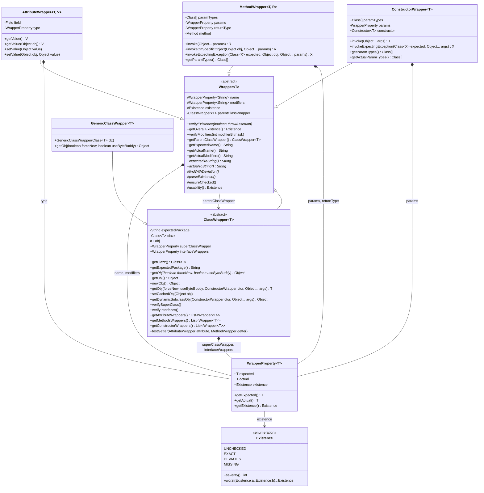
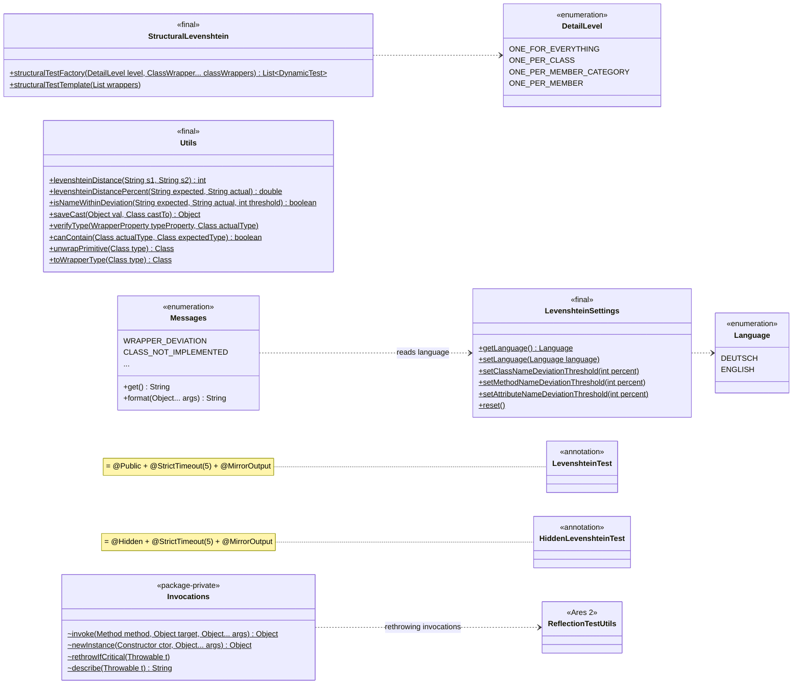
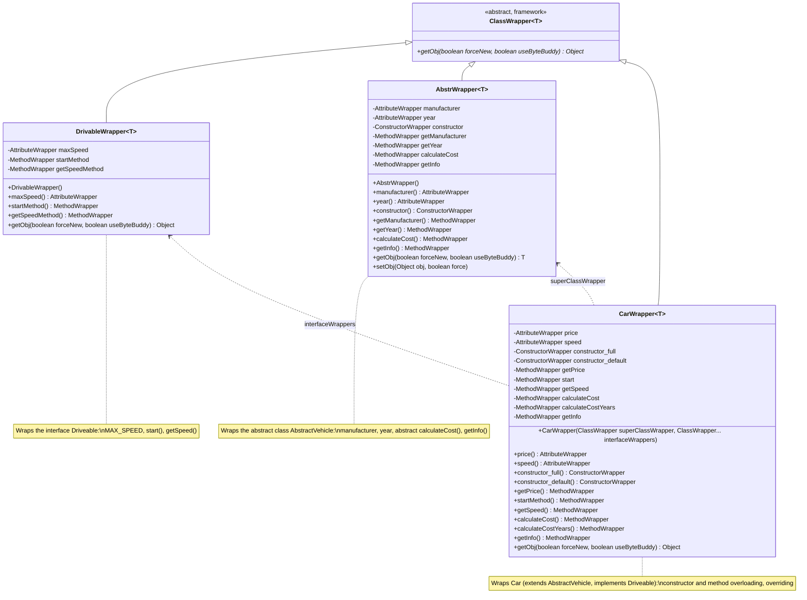

# Class Diagrams

Detailed class diagrams of the Levenshtein Testing Framework. The architecture overview is in the
[README](../README.md#architecture). The diagrams are [Mermaid](https://mermaid.js.org/) and render
directly on GitHub; keep them in sync with the code when public signatures change.

## Framework: wrappers (`io.github.valentinherrmann.levenshtein`)

Every wrapper describes one expected element of the student code and looks it up once, on first use.
`WrapperProperty` stores the expected and the actual value of each part (name, modifiers, types, ...) and
its `Existence`; the worst part decides the overall state.

## Framework: test generation, configuration and annotations

## Example exercise: wrappers (`io.github.valentinherrmann.example.tests.wrappers`)

One wrapper per expected class of the student code. Each wrapper declares its members as
`AttributeWrapper`, `MethodWrapper` and `ConstructorWrapper` fields (found by `ClassWrapper` via
reflection for the structural tests) and exposes them through accessors for the behavioural tests.
Expected names and types come from `Constants` (Exercise Variants pattern).

Each wrapper verifies existence, names, types and modifiers of its class with Levenshtein distance
tolerance; see [How Matching Works](../README.md#how-matching-works).
