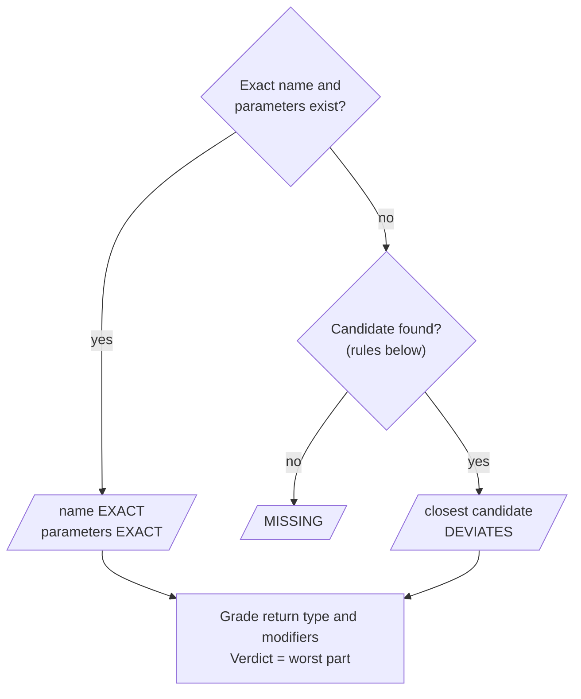

# How Matching Works

[README](../README.md) · [Quick Start](quick-start.md) · [Writing Tests](writing-tests.md) · [Ares 2 Setup](ares-setup.md) · **Matching** · [Architecture](architecture.md) · [Migration](migration.md) · [FAQ](faq.md)

**In short**

* A name matches if at most **20 %** (default) of the longer name differs (Levenshtein distance). The closest
  name wins.
* `int`/`Integer` and two numeric types (`int`/`long`/`double`, ...) **deviate**; other types do not match.
* Methods are found by name **and** parameters; return type and modifiers are only graded afterwards.
* Every part is `EXACT`, `DEVIATES` or `MISSING`; the **worst** part is the verdict.
* `DEVIATES` fails the structural test, but behavioural tests still run on the student's element.

The rest of this page is the reference for each kind of element.

* [The big picture](#the-big-picture)
* [Name matching](#name-matching)
* [Types](#types)
* [Modifiers](#modifiers)
* [Attributes](#attributes)
* [Methods](#methods): parameters, overloads, claiming, return type
* [Constructors](#constructors)
* [Classes](#classes): superclass and interfaces
* [From verdict to tests](#from-verdict-to-tests)
* [Debugging a non-match](#debugging-a-non-match)

## The big picture

Every wrapper has **parts**. Each part is judged on its own as `EXACT`, `DEVIATES` or `MISSING`, and the
verdict of the wrapper is the **worst** part (`MISSING` beats `DEVIATES` beats `EXACT`).

| State | Meaning | Examples |
|---|---|---|
| `EXACT` | Matches the specification | `price` / `price` |
| `DEVIATES` | Found with small differences; the structural test fails, behavioural tests use the actual element | `calculateCost` / `calculateCots`, `int` / `Integer`, `protected` instead of `public`, inherited indirectly, additional interface, unexpected `static` |
| `MISSING` | Not found or not usable as specified; the structural test and every behavioural test that needs it fail | name too different, `String` vs. `int`, missing `static` |

(`UNCHECKED` is an internal "not looked up yet" state. It never wins an aggregation and is never shown.)

A lookup always has **two phases**, and the order matters:

1. **Find one candidate element.** Only the *identifying* parts take part: the name and, for methods and
   constructors, the parameter types. If nothing qualifies, the wrapper is `MISSING` and stops here.
2. **Judge the other parts of that candidate.** Return type, modifiers, superclass and so on only *grade*
   the element that phase 1 picked. They never make the framework pick a different one.

| Wrapper | Identifying (phase 1) | Only graded (phase 2) |
|---|---|---|
| `AttributeWrapper` | name | type, modifiers |
| `MethodWrapper` | name **and** parameter types | return type, modifiers |
| `ConstructorWrapper` | parameter types (a constructor has no name) | modifiers |
| `ClassWrapper` | name (within the expected package) | modifiers, superclass, interfaces |

So a method with the right name and parameters but the wrong return type is found, and reported as a
return-type problem. It is not reported as a missing method.

Each wrapper looks up its element **once**, on first use, inside a supervised test. Only members *declared in
the class itself* are considered, not inherited ones (see [Methods](#methods)).

## Name matching

A name matches when its deviation is within the threshold. The deviation is the Levenshtein distance
(number of single-character inserts, deletes and replacements) as a percentage of the **longer** name:

```text
distance * 100 / max(expected.length(), actual.length())  <=  threshold
```

| Expected | Actual | Deviation | At 20 % |
|---|---|---|---|
| `price` | `pric` | 20.0 % | `DEVIATES` |
| `calculateCost` | `calculateCots` | 15.4 % | `DEVIATES` |
| `myCar` | `MyCar` | 20.0 % | `DEVIATES` |
| `start` | `strat` | 40.0 % (a swap is two edits) | `MISSING` |
| `Car` | `car` | 33.3 % (a case slip is one edit) | `MISSING` |

* The default is 20 %, separately for classes, methods and attributes. Change it with
  [`LevenshteinSettings`](writing-tests.md#configuration).
* Short names tolerate fewer typos: at 20 %, a name of 4 characters or less tolerates no edit at all, and
  a name needs 5 characters per allowed edit.
* If several candidates qualify, the one with the **smallest distance** wins. A tie is broken by the other
  identifying parts, then alphabetically (details per element below).
* An exact name always wins and is never compared with the others.

## Types

Types are graded for attributes (their type) and methods (their return type), in this order, first hit wins:

| Expected → actual | Verdict | Example |
|---|---|---|
| the same type | `EXACT` | `double` → `double` |
| primitive ⇄ its wrapper | `DEVIATES` | `int` → `Integer`, `Integer` → `int` |
| the actual type is a supertype of the expected one | `DEVIATES` | `String` → `Object` |
| another numeric type, wider or narrower | `DEVIATES` | `int` → `long`, `long` → `int`, `double` → `int` |
| anything else | `MISSING` | `String` → `int`, `boolean` → `int` |

Numeric types (`byte`, `short`, `char`, `int`, `long`, `float`, `double` and their wrappers) deviate in
both directions; `boolean` never mixes with them. Parameter types of methods and constructors follow the
[parameter rule](#how-the-candidate-is-chosen).

## Modifiers

Modifiers are graded after the element was found. They never decide *which* element is picked.

| Situation | Verdict |
|---|---|
| all expected modifiers present | `EXACT` |
| an expected `static` is missing | `MISSING` |
| any other expected modifier is missing (`public`, `final`, `abstract`, ...) | `DEVIATES` |
| a `static` attribute or method although `static` was not expected | `DEVIATES` |
| no modifier expected, but the element is `public`, `protected` or `private` | `DEVIATES` (no modifier means package-private) |

An unknown modifier in the specification (a typo) throws `IllegalArgumentException` when the wrapper is
created.

## Attributes

1. **Exact:** a field with exactly this name, declared in the class.
2. **Otherwise** the closest field within the attribute threshold. Synthetic fields are ignored, and so are
   fields whose name another attribute wrapper of the same class expects ([claiming](#claiming)).
3. The **type** and the **modifiers** of the found field are graded.

| Expected | Student | Verdict |
|---|---|---|
| `private double price` | `private double prize` | `DEVIATES` (name) |
| `private long count` | `private int count` | `DEVIATES` (numeric) |
| `private String label` | `private Object label` | `DEVIATES` (supertype) |
| `private int count` | `private boolean count` | `MISSING` (type) |

## Methods

A method is identified by its **name and its parameter types together**. This is what makes overloads
(`calculateCost()` and `calculateCost(int)`) work.

### How the candidate is chosen



A **candidate** is a method declared in the class that

- is not synthetic or a bridge method,
- is not [claimed](#claiming) by another `MethodWrapper` of the class,
- has a name within the method threshold,
- has matching parameters: the same number, in the same order, each one equal, a primitive/wrapper pair
  or two numeric types:

| Expected | Student | Parameters |
|---|---|---|
| `(int)` | `(int)` | `EXACT` |
| `(int)` | `(Integer)` | `DEVIATES` |
| `(int)` | `(long)` | `DEVIATES` |
| `(int, String)` | `(String, int)` | not a candidate (swapped) |
| `(int, int)` | `(int, int, int)` or `(int)` | not a candidate (count) |

The **closest** candidate wins: smallest name distance, then closest parameters (identical, then
primitive/wrapper, then numeric), then alphabetical name.

### Overloads

Overloads are told apart by their parameters, so each overload gets its own wrapper:

```java
// calculateCost()
calculateCost = new MethodWrapper<>(this, "calculateCost", double.class,
        "public");
// calculateCost(int)
calculateCostYears = new MethodWrapper<>(this, "calculateCost", double.class,
        new Class<?>[]{int.class}, "public");
```

Suppose the student wrote `calculateCost()` correctly but misspelled the overload as `calculateCots(int)`:

* The `()` wrapper finds `calculateCost()` exactly: `EXACT`.
* The `(int)` wrapper finds no `calculateCost(int)`, so it looks for a candidate. `calculateCost()` has the
  wrong number of parameters and is not a candidate. `calculateCots(int)` is (15.4 %). Result: `DEVIATES`.

### Claiming

A method that another `MethodWrapper` of the same class expects **exactly** (same name and parameter types)
is *claimed* and is never offered as a candidate to the other wrappers. Without this, a missing method
would silently be replaced by a similarly named one:

```text
wrappers:  getMinSpeed()  getMaxSpeed()
student:   getMinSpeed()

getMinSpeed  ->  EXACT
getMaxSpeed  ->  MISSING  (getMinSpeed is only 18.2 % away,
                           but it belongs to the other wrapper)
```

Attribute wrappers claim by name in the same way.

### Return type and modifiers

After the method was picked, its return type is graded like any [type](#types) and its modifiers like any
other [modifiers](#modifiers). `void` is just another return type:

| Expected | Student's method | Verdict |
|---|---|---|
| `public int getCount()` | `public long getCount()` | `DEVIATES` (wider) |
| `public double getPrice()` | `public int getPrice()` | `DEVIATES` (narrower) |
| `public int getCount()` | `public String getCount()` | `MISSING` |
| `public void util()` | `public static void util()` | `DEVIATES` (unexpected `static`) |
| `public static void util()` | `public void util()` | `MISSING` (`static` missing) |
| `public void packagePrivate()` | `void packagePrivate()` | `DEVIATES` (weaker visibility) |

### Inherited methods are not found

Only methods **declared in the class itself** are looked at. A method the student inherits from a superclass
is not found by the wrapper of the subclass:

```text
class Base  { public void inheritedOnly() }
class Garage extends Base

MethodWrapper "inheritedOnly" on the Garage wrapper  ->  MISSING
```

Put the wrapper on the wrapper of the class that declares the method, and let the subclass wrapper point to
it as its superclass wrapper (see [Inheritance and interfaces](writing-tests.md#inheritance-and-interfaces)).
This is also why the superclass is checked separately.

## Constructors

A constructor has no name, so only its **parameter types** identify it. There is no distance measure:

1. **Exact:** the declared constructor with exactly these parameter types (any visibility).
2. **Otherwise** the closest non-synthetic constructor whose parameters match by the
   [method parameter rule](#how-the-candidate-is-chosen) (identical, then primitive/wrapper, then
   numeric): `DEVIATES`.
3. **Otherwise** `MISSING`.
4. The modifiers of the found constructor are graded (a `protected` constructor where `public` was expected is
   `DEVIATES`).

Student has `Garage(int, String)` and `Garage(Integer)`:

| Expected | Verdict | Found |
|---|---|---|
| `(int, String)` | `EXACT` | `Garage(int, String)` |
| `(Integer, String)` | `DEVIATES` | `Garage(int, String)` |
| `(int)` | `DEVIATES` | `Garage(Integer)` |
| `(long)` | `DEVIATES` | `Garage(Integer)` |
| `(boolean)`, `(String, int)`, `()` | `MISSING` | |

Constructors are *not* claimed. If your wrappers expect both `(int)` and `(Integer)` and the student wrote
only one of them, both wrappers resolve to that constructor.

## Classes

A class wrapper finds the student's class by name inside the expected package:

1. **Exact:** the class `package.Name` is loaded **without initialisation**, so student static initialisers
   never run during the structural check.
2. **Otherwise** the closest class within the class threshold (ties alphabetically). Looked at are:
   * the compiled classes of that package,
   * generated spellings of the name: plural/singular, other case of the first letter, one character
     removed, two neighbouring characters swapped.

   Nested classes (`Outer$Inner`) are ignored unless a nested class was expected. A case slip such as
   `vehicle` for `Vehicle` (14.3 %) is found, `car` for `Car` (33.3 %) is not.
3. The **modifiers**, **superclass** and **interfaces** of the found class are graded.

### Superclass

| Expected | Student's class | Verdict |
|---|---|---|
| the class found by the superclass wrapper | extends exactly that class | `EXACT` |
| the class found by the superclass wrapper | extends it **indirectly** (`Leaf extends Mid extends Base`, expected `Base`) | `DEVIATES` |
| no superclass (`null`) | extends something other than `Object` | `DEVIATES` |
| a superclass | extends something unrelated, or only `Object` | `MISSING` |

A record extends `java.lang.Record` and an enum `java.lang.Enum` implicitly. Like `Object`, these count as
**no superclass**, so a record or enum wrapper expects `null` as its superclass.

The superclass is compared by the **class the superclass wrapper found**. If the student misspelled the
name of the superclass, the superclass wrapper reports `DEVIATES` for itself, while the subclass is still
`EXACT` here.

### Interfaces

The expected interfaces are compared by the classes their wrappers found:

| Situation | Verdict |
|---|---|
| exactly the expected interfaces | `EXACT` |
| an expected interface is implemented only indirectly (through the superclass or another interface) | `DEVIATES` |
| the student implements an **additional** interface | `DEVIATES` |
| an expected interface is not implemented at all | `MISSING` |

Extra *members* (fields, methods) in the student's class are ignored; only an extra interface is reported.

A class is usable in behavioural tests as soon as it has been **found**, even if its superclass or
interfaces deviate.

## From verdict to tests

| Verdict | Structural test | Behavioural call (`invoke`, `getValue`, ...) |
|---|---|---|
| `EXACT` | passes | works |
| `DEVIATES` | **fails** with a `DEVIATION` message | **works**, on the student's actual element |
| `MISSING` | **fails** with a `MISSING` message | **fails**: "... is not implemented as expected. See structural Tests" |

So a student with one typo loses the structural point once and still gets every behavioural point. A student
who is missing a method loses the structural point and every behavioural test that needs that method. See
[Writing Tests](writing-tests.md) for how to build both kinds of tests.

## Debugging a non-match

If a wrapper reports `MISSING` although the student "obviously" has the element:

1. **Name.** Compute `distance * 100 / maxLength` and compare it with the threshold. Remember that a swap of
   two letters is two edits.
2. **Parameters (methods and constructors).** Same number of parameters? Same order? A `String` where you
   expect an `int` makes it a different method (`long` for `int` only deviates).
3. **Claiming.** Does another wrapper of the same class expect this exact signature (or, for attributes,
   this exact name)? Then it is not available to this wrapper.
4. **Declared in this class?** An inherited method belongs to the wrapper of the class that declares it.
5. **Static.** An expected `static` that is missing makes the element `MISSING`, an unexpected `static` only
   `DEVIATES`.
6. **Type.** Numeric types deviate into each other; `boolean`, `String` and other unrelated types are
   `MISSING`.
